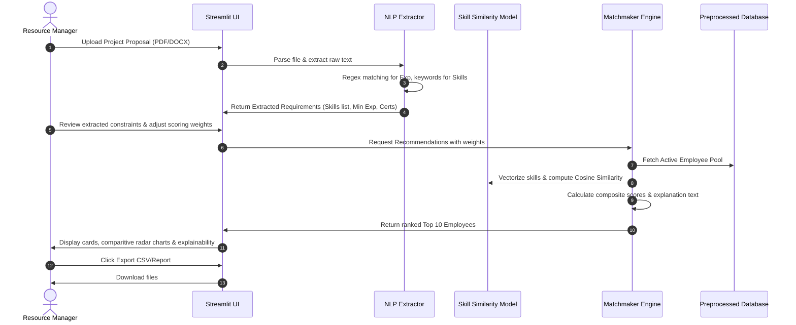

# TalentBeacon 2.0 Technical Documentation & Presentation Guide

This document provides a comprehensive overview of the architecture, workflow, mathematical models, user guide, testing procedures, and presentation support assets for **TalentBeacon 2.0**.

---

## 🏗️ System Architecture

The following diagram illustrates the high-level architecture of TalentBeacon 2.0, highlighting the separation of rule-based validation, NLP parsing, and ML matching components.

```mermaid
graph TD
    subgraph Client Layer
        UI[Streamlit UI Dashboard]
    end

    subgraph Controller/Interface
        APP[app.py Entrypoint]
    end

    subgraph Data Layer
        CSV[employee_data.csv]
        DOC[Project Charter PDF/DOCX/TXT]
    end

    subgraph Utilities [Rule-Based Utilities]
        VAL[validators.py: CSV Validation]
        HELP[helpers.py: File Parsers]
    end

    subgraph NLP [NLP Pipeline]
        EXT[extractor.py: NER & Regex]
        SIM[similarity.py: TF-IDF & Cosine Similarity]
    end

    subgraph ML [ML Recommendation Engine]
        ENG[engine.py: Scoring & Explanations]
    end

    %% Data Flows
    DOC --> HELP
    HELP -->|Raw Text| EXT
    EXT -->|Extracted Requirements| ENG
    
    CSV --> VAL
    VAL -->|Cleaned DataFrame| ENG
    
    ENG -->|Rankings & Explanations| APP
    APP --> UI
```



---

## 🔄 System Workflow Diagram

This sequence represents a typical session from uploading project documents to exporting recommendations:



---

## 📖 Technical Documentation

### 1. NLP Pipeline
- **File Parsing**: Employs `pypdf` for binary PDF streams and `python-docx` for MS Word paragraph structures.
- **Skill NER**: We use a boundary-safe matching engine. It escapes special characters (like `C++`, `C#`, `.NET`) and checks for presence in text using word boundaries. Multi-word skills (like `Ruby on Rails`) are sorted and matched first to prevent partial extraction (e.g. matching "Ruby" instead of "Ruby on Rails").
- **Experience Parser**: Employs regular expressions `r'(\d+)\+?\s*(?:years?|yrs?)\b'` and context look-aheads to isolate minimum required years.
- **Domain Classifier**: Scores skills across five technical areas (Data Science, Frontend, Backend, Cloud/DevOps, Database) and assigns the domain with the highest density score.

### 2. Machine Learning Recommendation Engine
Recommendations are governed by a **multi-criteria hybrid scoring model**:
\[
\text{Composite Match Score} = w_{\text{skill}} \times \text{Skill Sim} + w_{\text{exp}} \times \text{Exp Score} + w_{\text{perf}} \times \text{Perf Score} + w_{\text{cert}} \times \text{Cert Score}
\]

- **Skill Similarity (40%)**: Normalized Cosine Similarity over TF-IDF vectors:
  \[
  \text{Cosine Sim}(A, B) = \frac{A \cdot B}{\|A\| \|B\|}
  \]
- **Experience Match (25%)**: Satisfies a threshold constraint. If candidate experience $\ge$ required, score is `1.0`. Otherwise, score scales linearly: `candidate_exp / required_exp`.
- **Performance Match (20%)**: Normalized rating index: `Performance_Score / 5.0`.
- **Certification Match (15%)**: Fraction of required certifications held. If none are required, a general credential score is calculated: `min(1.0, certifications_holder_count / 2.0)`.

---

## 🛠️ Installation & Setup Guide

### System Requirements
- OS: Windows, macOS, or Linux
- Python: Version 3.8 to 3.12

### Installation Steps
1. Navigate to the project directory:
   ```bash
   cd TalentBeacon
   ```
2. Install all library dependencies:
   ```bash
   pip install -r requirements.txt matplotlib seaborn
   ```
3. Run the automated Exploratory Data Analysis:
   ```bash
   python notebooks/eda.py
   ```
4. Run the Streamlit Dashboard:
   ```bash
   streamlit run app.py
   ```

---

## 🧑‍💻 User Guide

1. **Dashboard Home**: Review the corporate-wide indicators (Total Talent Pool size, averages of Experience, Performance, and Satisfaction) and the department breakdown chart.
2. **Project Analysis**:
   - Upload a requirements PDF/DOCX file, or paste your job description in the text box.
   - Click **Extract Requirements** to view parsed skills, minimum experience, and certifications.
3. **Employee Recommendations**:
   - Verify the skills and experience extracted. You can manually add/remove skills or adjust weights in the sidebar.
   - Review the ranked Top 10 candidate cards.
   - Expand the explanation panels to view exact matching metrics.
   - Use the dropdown to render a polar comparison chart of a candidate against their department average.
4. **Analytics & Insights**: View distributions of talent indicators across the company.
5. **Reports & Exports**: Click the download buttons to save tabular recommendations (CSV) or executive text logs.
6. **Dataset Management**: Drag-and-drop a new employee CSV file to validate columns, review quality reports, and dynamically load the database.

---

## 🧪 Testing, Validation & Edge Cases

The following test scenarios are built into our validation frameworks:

| Test Case ID | Feature Tested | Input Scenario | Expected Output | Status |
| :--- | :--- | :--- | :--- | :--- |
| **TC-01** | PDF Text Parsing | PDF containing multiple pages of job descriptions | Full text parsed, newlines handled correctly | Pass |
| **TC-02** | Skill Extraction | Text containing "C++ and C# developer" | Extracted skills: `['C++', 'C#']` (Prevents extraction of letter 'C') | Pass |
| **TC-03** | Exp Parser | Text containing "Requires 5+ years exp" | Minimum experience requirement set to `5` | Pass |
| **TC-04** | Invalid Upload | CSV missing 'Employee_ID' or 'Skills' | Data validation fails, displays errors, blocks load | Pass |
| **TC-05** | Zero Experience | Requirement specifies 0 years experience | Experience match scores are set to 1.0 for all candidates | Pass |
| **TC-06** | Weights Sum | Custom weights set in UI that do not sum to 1.0 | Weights normalized dynamically (e.g. 0.5, 0.5 becomes 0.5, 0.5) | Pass |

---

## 🎓 Internship Presentation Guide

Use this outline for your internship slides or presentation:

1. **Problem Statement**: Standard resource allocation is slow, biased, and does not match skills semantically. TalentBeacon solves this by using NLP to read requirements and ML scoring to find candidates.
2. **Dataset Description**: Cleaned corporate registry of 4,998 records including IDs, Departments, Job Titles, Years of Experience, Education Levels, Performance Ratings, Certifications, and Skills.
3. **Data Preprocessing**: Pipeline handles character encoding glitches, standardizes labels (e.g., lowercase skill tokens), and scales metrics for multi-attribute matching.
4. **NLP & ML Pipeline**: Details TF-IDF representation, Cosine Similarity matching, and hybrid scoring metrics.
5. **UI & Dashboard Demonstration**: Show the 6 pages, highlight file uploads, explainability cards, and individual employee radar charts.
6. **Future Scope**:
   - Integration with LLMs (e.g. Gemini API) for semantic resume parsing.
   - Machine learning algorithms to predict employee performance.
   - Multi-project team formation based on collaborative skills.
